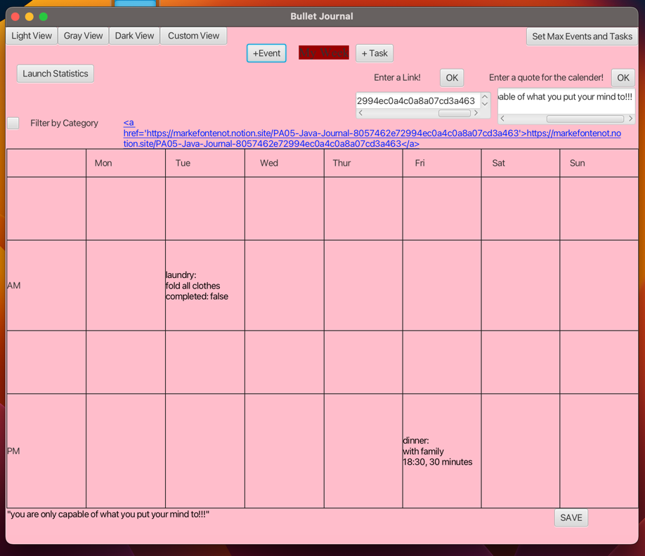

# 3500 PA05 Project Repo

[PA Write Up](https://markefontenot.notion.site/PA-05-8263d28a81a7473d8372c6579abd6481)

# Program Pitch
- our program has numerous features, that allow for customization, interaction, and extensive usability
- week view: users are able to be an interactive view of their week plans, including their events and tasks for the week
- event and task creation: users are also able to create events and tasks that appear on the view through buttons and entering data values into a popup
- commitment warnings: when a user reaches its max amount of tasks or events, and goes to make that object in the calendar, a warning pops up in the popup
- persistence: our program allows users to save their calendars to a file of their name. This file can then be opened by typing its name into the open popup
- themes: users can choose between 3 themes using buttons found on the view
- categories: each event and task is assigned a category
- quotes and notes: users can input a quote/note into the text area, and it will print out onto the view
- weekly overview: the button "Launch Statistics" takes users to a popup containing weekly overview statistics
- Takesie-Backsies: users have the option to delete a task/event by using the delete button
- links: users can enter a link into the text area and it will print out on the week view
- custom theme: users can choose a custom theme by hitting "Custom View", typing in input and applying

# SOLID Principles
- Single Responsibility Principle:
Our code follows the single responsibility principle because we have a different class for every purpose and objective within our program.
We have a class that writes and reads files, we have a controller class, we have a utils class, we have different classes for every object, 
and we have a class for the view of our program. The breakdown of these classes demonstrates SRP.
- Open/Close Principle:
We have made the code open for extension, in the sense that more buttons, event handlers, and attributes can be added to the code. 
However, the code is closed to modification, since fields and methods have been made private and the current implementations 
cannot be modified
- Liskov Substitution principle:
This applies to our code, as we have super and sub classes, and in all the cases that these exist, calling a subclass as a superclass
does not break the program. They work with each other to create a more dynamic and cohesive program.
- Interface Segregation Principle:
We have numerous interfaces within our code that are specific, so that implementers of code do not have to worry about writing
excess or redundant code.
- Dependency Inversion:
We do this by injecting calendar events into our controller, and controllers into our view. This creates dependency between classes to create
interconnectivity between them so the code is dynamic and all parts of it communicate and update one another.
